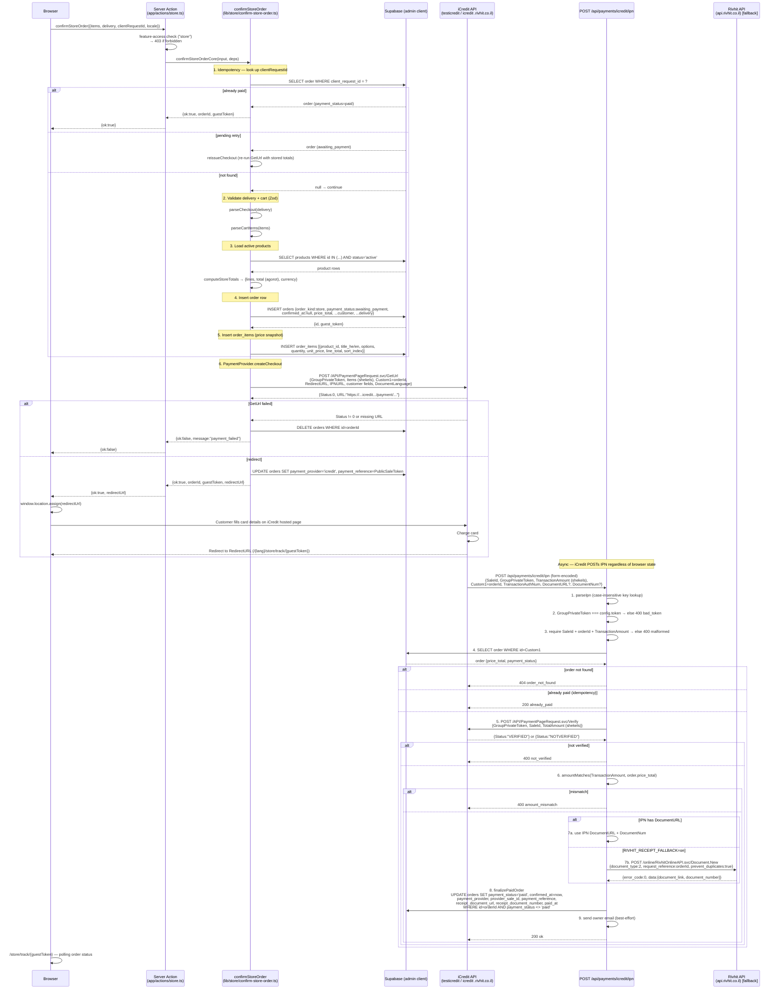

# Store Checkout Flow

The store cart uses a **create-at-confirm** model (no draft row — the cart lives client-side) with iCredit hosted-page redirect as the payment provider. The sticker shop uses a different, mock-only flow; this document covers **only the store cart**.

---

## Flow Diagram



---

## Key iCredit Endpoints

| Endpoint | Method | Auth | Purpose |
|---|---|---|---|
| `{host}/API/PaymentPageRequest.svc/GetUrl` | POST JSON | `GroupPrivateToken` in body | Request a hosted payment page; returns a one-time `URL` |
| `{host}/API/PaymentPageRequest.svc/Verify` | POST JSON | `GroupPrivateToken` in body | Confirm a sale by `SaleId`; returns `{Status:"VERIFIED"}` |
| `{NEXT_PUBLIC_SITE_URL}/api/payments/icredit/ipn` | POST form-encoded | `GroupPrivateToken` in body | iCredit IPN webhook (our endpoint, iCredit calls it) |

Hosts:

| `ICREDIT_MODE` | Host |
|---|---|
| `test` | `https://testicredit.rivhit.co.il` |
| `prod` | `https://icredit.rivhit.co.il` |

### GetUrl — key request fields

```jsonc
{
  "GroupPrivateToken": "<GUID>",         // ICREDIT_GROUP_PRIVATE_TOKEN
  "Items": [
    {
      "Id": 0,
      "CatalogNumber": "<productId>",
      "UnitPrice": 12.50,                // shekels (not agorot!)
      "Quantity": 2,
      "Description": "Product title"
    }
  ],
  "RedirectURL": "https://site/he/store/track/<guestToken>",
  "IPNURL": "https://site/api/payments/icredit/ipn",
  "Custom1": "<orderId>",                // echoed back in IPN
  "DocumentLanguage": "he",             // or "en"
  "ExemptVAT": false,
  "HideItemList": false,
  "EmailAddress": "customer@example.com",
  "CustomerFirstName": "...",
  "CustomerLastName": "...",
  "PhoneNumber": "...",
  "Address": "...",
  "City": "...",
  "Zipcode": "..."
}
```

### GetUrl — response

```jsonc
{
  "Status": 0,            // 0 = success; non-zero = failure
  "URL": "https://testicredit.rivhit.co.il/payment/PaymentItems.aspx?GroupId=...&Token=...",
  "PublicSaleToken": "<guid>",
  "PrivateSaleToken": "<guid>",
  "DebugMessage": null    // populated on failure
}
```

### Verify — request/response

```jsonc
// Request
{ "GroupPrivateToken": "<GUID>", "SaleId": "<guid>", "TotalAmount": 25.00 }  // shekels

// Response
{ "Status": "VERIFIED" }   // or "NOTVERIFIED"
```

### IPN — inbound form fields (iCredit → our server)

| Field | Type | Notes |
|---|---|---|
| `SaleId` | string | iCredit sale GUID |
| `GroupPrivateToken` | string | Must match `ICREDIT_GROUP_PRIVATE_TOKEN` |
| `TransactionAmount` | number (string) | In **shekels**; compared against `price_total` agorot |
| `Custom1` | string | Our `orderId` |
| `TransactionAuthNum` | string \| null | Auth number; used as `payment_reference` (falls back to `SaleId`) |
| `DocumentURL` | string \| null | Receipt URL if iCredit auto-issued one |
| `DocumentNum` | string \| null | Receipt number |
| `DocumentType` | string \| null | Document type code |

Field names are matched **case-insensitively** in `parseIpn`.

---

## Rivhit Receipt Fallback

When `RIVHIT_RECEIPT_FALLBACK=on` and the IPN has no `DocumentURL`:

```
POST https://api.rivhit.co.il/online/RivhitOnlineAPI.svc/Document.New
Authorization: api_token = RIVHIT_API_TOKEN
```

```jsonc
{
  "document_type": 2,               // חשבונית מס קבלה
  "request_reference": "<orderId>", // idempotency key
  "prevent_duplicates": true,
  "payment_type": 3,                // RIVHIT_RECEIPT_PAYMENT_TYPE (default 3)
  "language": "he"                  // RIVHIT_LANGUAGE (default "he")
  // ... customer + line item fields
}
```

Response envelope: `{error_code, client_message, debug_message, data}`. `error_code === 0` → `data.document_link` + `data.document_number` stored on the order.

---

## Security Invariants

1. **Cart is re-priced server-side.** `computeStoreTotals` runs in the server action; client-sent prices are never trusted.
2. **GetUrl is server-to-server.** The browser never sees the GroupPrivateToken or prices — it only receives the resulting hosted-page URL.
3. **Verify before marking paid.** The IPN body is not trusted alone. `Status === "VERIFIED"` from the Verify endpoint is required.
4. **Amount double-check.** After Verify, `TransactionAmount` (shekels) is compared to `order.price_total` (agorot). A mismatch returns non-2xx so iCredit retries.
5. **Partial-unique `provider_sale_id` index.** Prevents a replayed IPN from paying the same order twice at the DB level. The `payment_status <> 'paid'` filter in `finalizePaidOrder` is the in-memory fast-path.
6. **Money is agorot internally.** Only converted to shekels at the iCredit/Rivhit edge (`agorotToShekels`). Never stored or compared as floats.

---

## Idempotency

- **`clientRequestId`** (UUID minted by the browser in `sessionStorage`): a partial-unique index on `orders` prevents duplicate rows from double-submit. On a 23505 conflict the winner's order is returned.
- **`finalizePaidOrder`** guards with `WHERE payment_status <> 'paid'` — a second IPN for the same order returns `already_paid` without re-updating.
- **`provider_sale_id`** partial-unique index (WHERE NOT NULL) prevents a single `SaleId` from finalizing multiple orders.

---

## Mock Mode

When `ICREDIT_MODE` is unset or `"mock"`, `getPaymentProvider()` returns the manual provider. `createCheckout` returns `{status:"paid"}` immediately. `finalizePaidOrder` is called inline in the server action — no redirect, no IPN. The browser gets `{ok:true}` directly and navigates to the track page.

---

## File Map

| File | Role |
|---|---|
| `app/actions/store.ts` | Server action: wires admin client, provider, deps |
| `lib/store/confirm-store-order.ts` | Core: validate → price → insert → checkout dispatch |
| `lib/store/pricing.ts` | `computeStoreTotals` — server-authoritative pricing |
| `lib/store/checkout-payload.ts` | `toCheckoutItems`, `toCheckoutCustomer` — pure builders |
| `lib/store/checkout-navigation.ts` | `nextNavigation` — route after mock vs redirect |
| `lib/payments/provider.ts` | `PaymentProvider` interface + `CreateCheckoutInput` types |
| `lib/payments/index.ts` | `getPaymentProvider()` — mock vs iCredit env switch |
| `lib/payments/icredit/config.ts` | `getIcreditConfig()` → `{mode, host, token}` |
| `lib/payments/icredit/client.ts` | `requestPaymentPage` (GetUrl), `verifySale` (Verify) |
| `lib/payments/icredit/provider.ts` | `createIcreditProvider` implementing `PaymentProvider` |
| `lib/payments/icredit/handle-ipn.ts` | `handleIcreditIpn` — all webhook branch logic (DI core) |
| `lib/payments/icredit/ipn.ts` | `parseIpn` — case-insensitive IPN field parser |
| `lib/payments/icredit/money.ts` | `agorotToShekels`, `shekelsToAgorot`, `amountMatches` |
| `lib/payments/rivhit/issue-receipt.ts` | Rivhit `Document.New` fallback |
| `lib/orders/finalize-paid-order.ts` | The one idempotent finalize path for store orders |
| `app/api/payments/icredit/ipn/route.ts` | Next.js POST route — thin handler → `handleIcreditIpn` |
| `components/store/store-checkout.tsx` | Client: submits action; on `redirectUrl` → `window.location.assign` |
